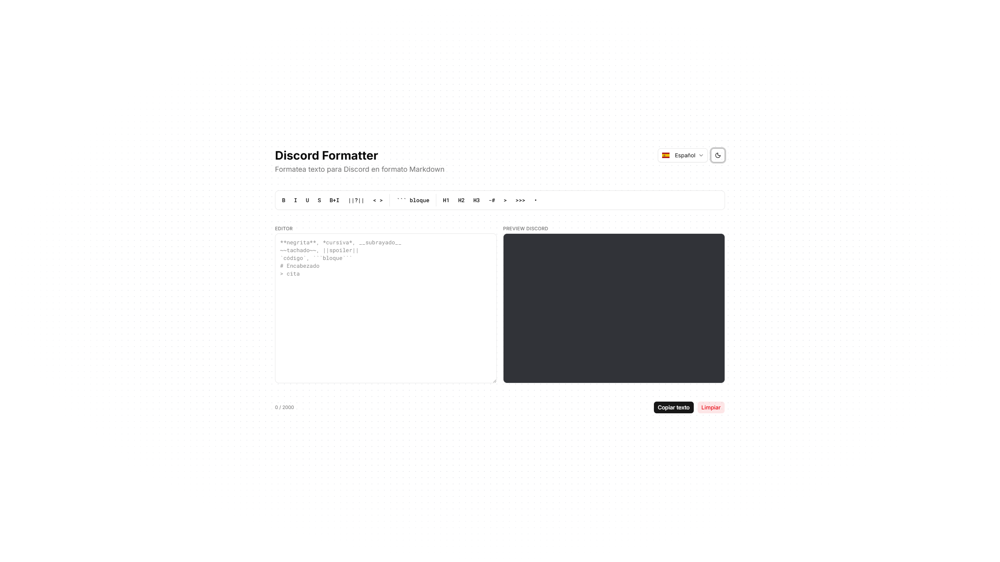

# Discord Formatter

Una herramienta web gratuita para formatear texto con Markdown de Discord. Escribe en el editor y ve el resultado en tiempo real con el aspecto visual exacto de Discord.



## ✨ Funcionalidades

- **Preview en tiempo real** — ve cómo quedará tu texto en Discord mientras escribes
- **Barra de herramientas completa** — botones para todos los formatos de Markdown de Discord
- **Modo claro / oscuro** — cambia entre temas con un solo clic
- **Multiidioma** — interfaz en español e inglés, detecta el idioma del navegador automáticamente
- **Contador de caracteres** — aviso visual al acercarte al límite de 2000 caracteres
- **Copiar al portapapeles** — copia el texto formateado con un clic
- **Spoilers clicables** — en el preview puedes revelar los spoilers haciendo clic
- **Responsive** — funciona en móvil, tablet y escritorio

## 🎨 Formatos soportados

| Formato           | Sintaxis        |
| ----------------- | --------------- |
| Negrita           | `**texto**`     |
| Cursiva           | `*texto*`       |
| Subrayado         | `__texto__`     |
| Tachado           | `~~texto~~`     |
| Negrita + cursiva | `***texto***`   |
| Spoiler           | `\|\|texto\|\|` |
| Código inline     | `` `texto` ``   |
| Bloque de código  | ` ```lenguaje ` |
| Encabezado H1     | `# texto`       |
| Encabezado H2     | `## texto`      |
| Encabezado H3     | `### texto`     |
| Subtexto          | `-# texto`      |
| Cita              | `> texto`       |
| Cita multilínea   | `>>> texto`     |
| Lista             | `- texto`       |

## 🛠️ Tecnologías

- [React](https://react.dev/)
- [Vite](https://vitejs.dev/)
- [Tailwind CSS v4](https://tailwindcss.com/)
- [shadcn/ui](https://ui.shadcn.com/)
- [Lucide React](https://lucide.dev/)
- [Sonner](https://sonner.emilkowal.ski/)
- [Flag Icons](https://flagicons.lipis.dev/)

## 🌐 Demo

[discord-formatter.vercel.app](https://tu-dominio.com)

## 📄 Licencia

MIT © [xNando](https://github.com/xNando)
